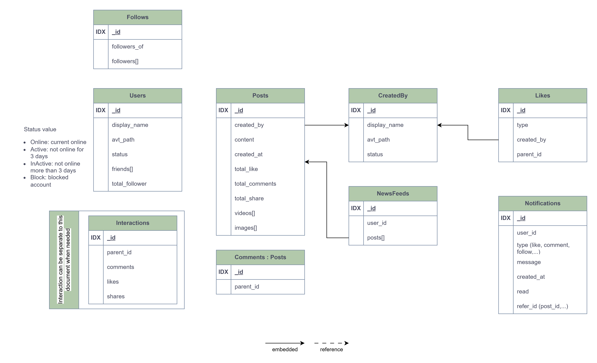

# Social network project

This project is Social network system  
Progress:

- Frontend:
  - [x] Login/Register
  - [ ] Dashboard
  - [ ] News feed
  - [ ] Create post
  - [ ] Message
  - [ ] ...
- Backend:
  - [x] Auth api
  - [ ] Resource api (post, comment,...)
  - [ ] Message queue for feed new post
  - [ ] Realtime notification
  - [ ] ...

## Techstack

### Frontend

- Language: Javascript/Typescript
- Framework: NextJS
- Style: TailwindCss, Shadcn, LucideIcon,...

### Backend

- Language: Go
- Framework: Go-gin
- Database: MongoDB

## System Design
### Database
- Documents view

- Embedded view

### Post and NewsFeed flow
