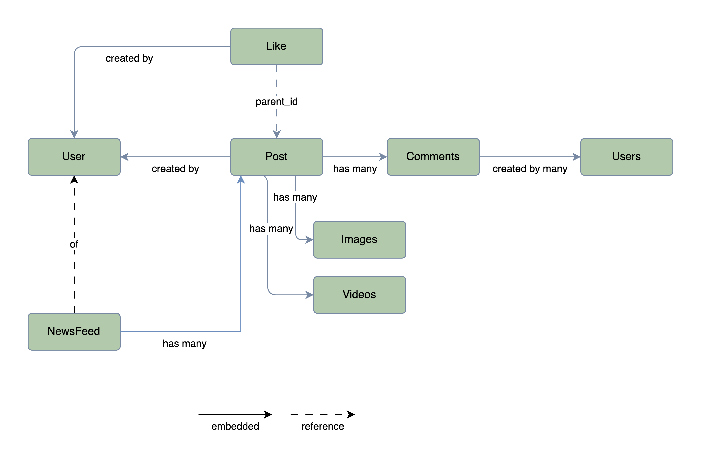

# Full-stack Social Network

Upgrade of old project: <https://github.com/daklod2k3/sgu-social>

Full-stack Social Network using NextJS for Front-end and Microservice Back-end combine multi stack (Go, Spring,...)

## Techstack

### Frontend

- Language: Javascript/Typescript
- Framework: NextJS
- Style: TailwindCss, Shadcn, LucideIcon,...

### Backend

- Api Gateway: Kong gateway
- Language: Go, Java
- Architectural: Microservice
- Service communicate: gRPC
- Design approach: Domain-Driven Design
- Framework: Go-gin, Spring,...
- Database: MongoDB, PostgreSQL

## System Design

### Overview

### Services

### Database

- Documents view
  
  Updating...
- Embedded view
  
  Updating...

### Login/Register flow

### Post and NewsFeed flow

